# stm32超声波避障小车

## 小车照片
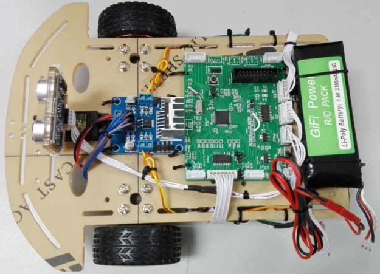

## 程序主体流程
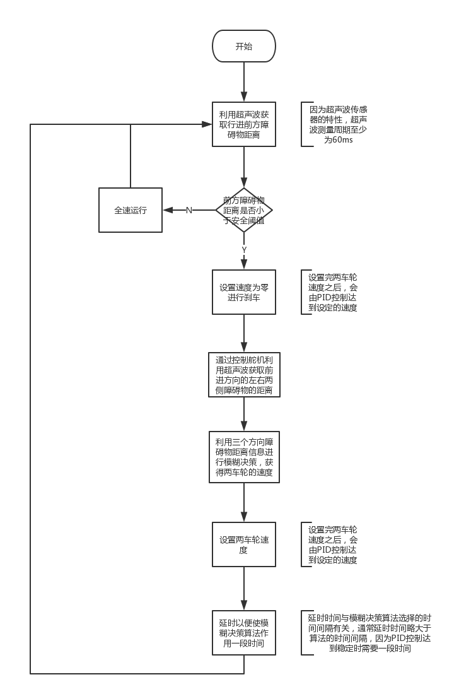

## 主要模块介绍

### PID控制模块

1. PID控制器  
PID控制器由比例单元(P)、积分单元(I)和微分单元(D)组成。这个控制器把收集到的数据和一个参考值进行比较，然后把这个差别用于计算新的输入值，这个新的输入值的目的是可以让系统的数据达到或者保持在参考值。
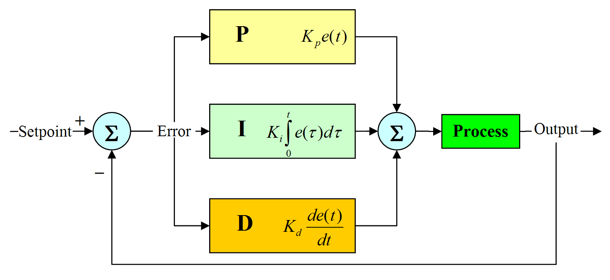

2. PID算法介绍  
PID控制可以分为模拟PID控制和数字PID控制。由于计算机实现微分和积分运算比较复杂，因此一般使用数字PID控制。
PID算法又可以分为位置式和增量式。公式1和公式2都是位置式，由于要不断的累加，增加了计算量，因此位置式算法可以转换为增量式算法，
如公式3所示。在小车的PID控制中只需要使用增量式算法就可以达到很好的效果。
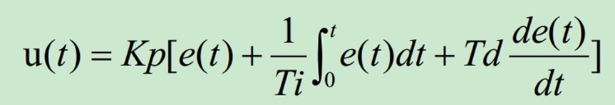  
公式1 模拟PID控制  
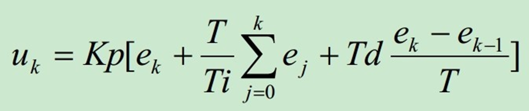  
公式2 数字PID控制  
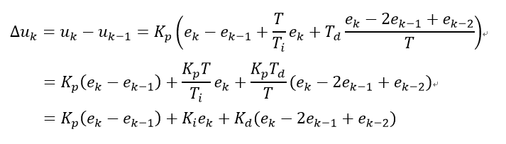  
公式3 位置式转换为增量式  
其中Kp为比例系数，Ki为积分系数，Kd为微分系数，T为采样周期，Ti为积分时间，Td微分时间，有些资料还将Kp表示为比例带p的倒数。
3. PID整定参数方法  
位置式PID和增量式PID整定参数的方法大同小异，都可以采用下面的试凑口诀。为了加速整定PID控制的参数，使用Qt编写了图形化整定PID参数的程序：电脑端通过蓝牙接收小车的速度信息，实时绘制小车的速度变化曲线， 根据曲线可以直接在电脑端修改小车的PID参数，加速了PID整定参数的过程。
> 参数整定找最佳， 从小到大顺序查。  
先是比例后积分， 最后再把微分加。  
曲线振荡很频繁， 比例度盘要放大。  
曲线漂浮绕大弯， 比例度盘往小扳。  
曲线偏离回复慢， 积分时间往下降。  
曲线波动周期长， 积分时间再加长。  
曲线振荡频率快， 先把微分降下来。  
动差大来波动慢， 微分时间应加长。  
理想曲线两个波， 前高后低四比一。  
一看二调多分析， 调节质量不会低。  

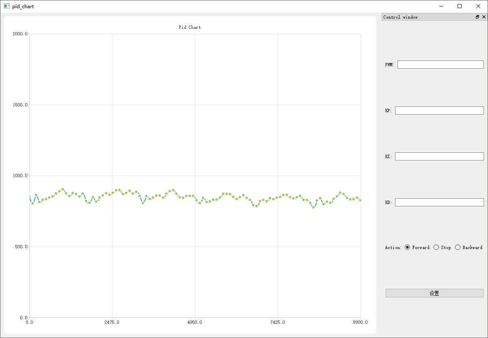  

4. PID在小车中的实现
    1. 小车电机上带有光电码盘，电机转动是会产生信号，为了将信号作为TIM1和TIM8的触发计数信号，需要将TIM1和TIM8配置为编码器模式。
这样，小车前进时TIM1和TIM8的计数器就会增加；后退时TIM1和TIM8的计数器就会减少。通过前后两次的测量可以得到在一段时间内的脉冲变化量，
需要注意的是这里的PID不是直接控制速度，而是控制一段时间内的脉冲变化量达到设定值，一段时间内的脉冲变化量也可以表征小车速度，
那为什么不直接控制速度呢？这是因为我们获得的是光电码盘的脉冲数据，需要经过转换才可以得到速度，
如果PID的控制量是速度，那么每进行一次PID控制都需要作一次转换，浪费时间，因此这里将PID的控制量设置为一段时间内的光电码盘脉冲数。
    2.  在上面的讨论中，我们一直说的是一段时间内的光电码盘脉冲数，那么这一段时间究竟是多少，怎么实现每隔一段时间获取光电码盘的脉冲数？
我们都知道，PID控制需要每隔一段时间根据反馈的数据控制一次，形成闭环。我们把这段时间称为采样周期，而反馈的数据就是这段时间内光电码盘脉冲数变化量。
采样周期是经过不断尝试，设定的一个比较合理的值，在本程序中是100ms。到这里我们已经解决了第一个问题。那究竟是谁在控制着这整个过程的呢？
在上面我们已经将TIM1和TIM8配置为编码器模式了，也知道它们会随着电机转动而改变计数值，但是我们还需要间隔一个采样周期捕获一次计数器的值，
聪明的同学已经想到可以利用定时器的捕获功能，没错，我们需要每隔一个采样周期就触发TIM1和TIM8捕获一次，这个重任就落到了TIM2的身上了，
设定TIM2定时100ms，产生一个触发信号，将此信号连接到TIM1和TIM8的输入捕获通道，TIM1和TIM8就会将此时计数器的值保存在对应的捕获寄存器中，
通过前后两次数值的对比，我们就可以获得采样周期（100ms）内脉冲的变化量了。每当PID控制正常工作时，我们都不能忘了TIM2一直在背后默默地工作。
    3. 到这里，我们已经获得了采样周期内脉冲的变化量了，但是这个脉冲变化量有什么作用呢？
在（1）的讨论中我们已经知道单位采样周期内的脉冲变化量可以转换为单位采样周期内的速度，表征速度的快慢，具体怎么转换的请参考程序代码。
我们对小车进行PID控制的目的就是为了让小车达到设定的速度值，也就是为了让小车在单位采样周期内的脉冲变化量大致等于设定值。
接下来我们只需要将脉冲变化量交给PID控制算法即可，要知道PID控制算法可是不挑食的，不管你给的是速度还是单位采样周期内的脉冲变化量，
它都能够保证使其达到设定值，我们所要做的工作就是整定PID的三个参数，使其达到比较好的效果。本程序是按照试凑口诀整定参数的。
    4. 到这里，PID算法已经获得了反馈回来的脉冲数了，但是我们最终的目的还是控制小车的速度，学过电机控制的同学都知道，
我们是通过改变电机的PWM信号的占空比来改变电机的转速的，这里也不例外。PID算法的强大之处就在于它建立起了反馈回来的脉冲数和PWM信号占空比之间的关系。
因为程序使用的是增量式PID,所以PID算法输出的是PWM信号的增量，如果反馈回来的脉冲数超过设定值，PID算法就会适当地减少PWM信号的占空时间；
否则就会增加PWM信号的占空时间。需要注意的是小车有两个电机，它们同时由TIM2触发PID控制，但是它们的PID控制是独立的，有两路的反馈信号和PWM输出信号。
PID算法输出的占空时间会给到TIM5，由TIM5控制两个电机的转动。
    5. 以上过程不断重复，构成了闭环的PID控制。

---

### 模糊决策算法模块
1. 模糊逻辑简介  
传统的布尔逻辑对于一个元素是否属于一个集合只有两种判断：属于和不属于。但是模糊逻辑是通过隶属度函数计算归属度来描述元素与集合的关系。
2. 模糊决策算法的主要步骤
    1. 确定输入，并且规定它们的范围以及命名
    2. 确定输出，并且规定它们的范围以及命名
    3. 为所有输入和输出设立隶属度函数
    4. 构建系统推理过程遵循的规则库
    5. 结合规则，对模糊输出进行反模糊化
3. 模糊决策算法主要流程
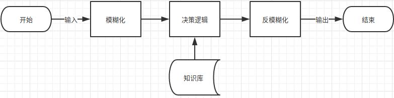

4. 模糊决策算法在小车上的实现
    1. 小车的模糊决策输入为超声波传感器采集的距离信息。我们在小车上主要测量三个方向的距离信息。他们分别为左边，右边和前方，记为DL，DR和DF。我们需要避开障碍物的最大距离为8dm，
输入语言变量的取值为{"远","近"}。这个输入模糊集的隶属度函数图像如下图：  
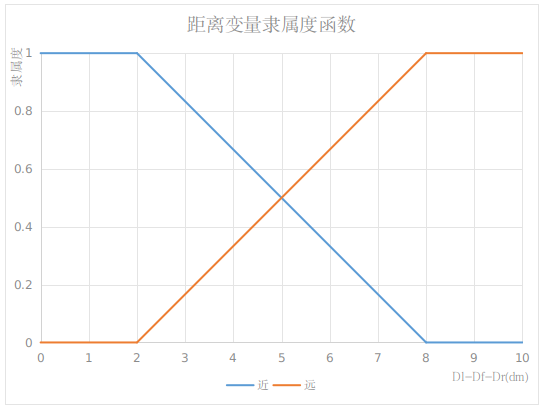
    2. 小车的输出模糊变量是车身的速度V和需要转动的角度α。小车的速度最快设定为23dm/s，小车转动角度区间是：(-90°，90°)。那么V的取值集合为{“快”，“慢”}，α的取值集合为{“正左”，“左前”，“正前”，“右前”，“正右”}。V和α的隶属度函数如下图所示：  
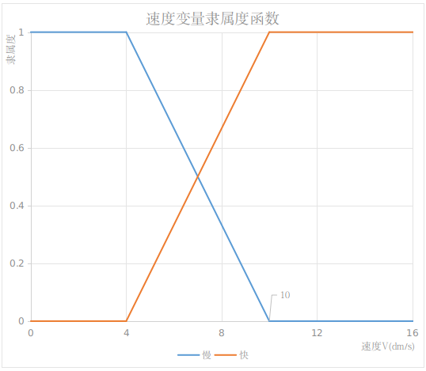  
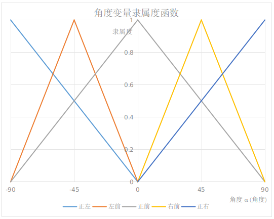
    3. 构建规则库实现对小车的控制
        1. 如果DL为远，DF为远，DR为远， V为快，α为正前
        2. 如果DL为远，DF为近，DR为远， V为慢，α为正右
        3. 如果DL为远，DF为远，DR为近， V为慢，α为左前
        4. 如果DL为远，DF为近，DR为近， V为慢，α为正左
        5. 如果DL为近，DF为远，DR为远， V为慢，α为右前
        6. 如果DL为近，DF为近，DR为远， V为慢，α为正右
        7. 如果DL为近，DF为远，DR为近， V为慢，α为正前
        8. 如果DL为近，DF为近，DR为近， V为慢，α为正右
    4. 通过加权平均法实现反模糊化  
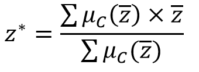  
式中，z\*表示反模糊化后的输出值(速度和角度)，z的平均数表示当前隶属度函数的形心。速度的隶属度函数“慢”的形心为4dm/s，“快”的形心为10dm/s。对于角度变量，“左前”、“正前”和“右前”分别为-45°、0°和45°；而“正左”与“正右”的形心分别为-90°与90°。Uc是形心的隶属度函数值。
    5. Example  
假设某时刻，超声波传感器的读数为DL=3dm,DF=2.5dm,DR=4.5dm。那么经过模糊化后，我们可以得到隶属度值:  
DL：O远（DL）=0.17，O近（DL）=0.83  
DF：O远（DF）=0.08，O近（DF）=0.92  
DR：O远（DR）=0.42，O近（DR）=0.58  
随后通过匹配上述列出的8条规则，我们得到：  
O1=min[O远（DL）, O远（DF）, O远（DR）]=0.08  
O2=min[O远（DL）, O近（DF）, O远（DR）]=0.17  
O3=min[O远（DL）, O远（DF）, O近（DR）]=0.08  
O4=min[O远（DL）, O近（DF）, O近（DR）]=0.17  
O5=min[O近（DL）, O远（DF）, O远（DR）]=0.08  
O6=min[O近（DL）, O近（DF）, O远（DR）]=0.42  
O7=min[O近（DL）, O远（DF）, O近（DR）]=0.08  
O8=min[O近（DL）, O近（DF）, O近（DR）]=0.58  
V快=max[0.08]=0.08  
V慢=max[0.17,0.08,0.17,0.08,0.42,0.08,0.58]=0.58  
α正左=max[0.17]=0.17  
α左前=max[0.08]=0.08  
α正前=max[0.08,0.08]=0.08  
α右前=max[0.08]=0.08  
α正右=max[0.17,0.42,0.58]=0.58  
我们利用“加权平均法”进行反模糊化，可得到输出值为：  
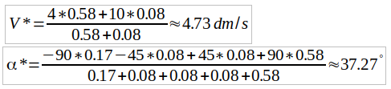  
根据人的实际经验，小车在当前情况以4.73dm/s的速度向右转37.27°能够较好做到避开障碍物。

---

### 超声波驱动模块
通过一个至少10us高电平的脉冲作为触发信号启动超声波，通过检测回响信号的高电平脉宽可以获得障碍物的距离。程序并没有借助定时器的PWM输入实现脉宽检测，
而是通过轮询的方式进行脉宽的测量。需要注意的是为了防止发射信号影响回响信号，超声波测量周期应为60ms以上。

---

### 舵机驱动模块
通过脉宽控制舵机的转动角度，如下图所示：  
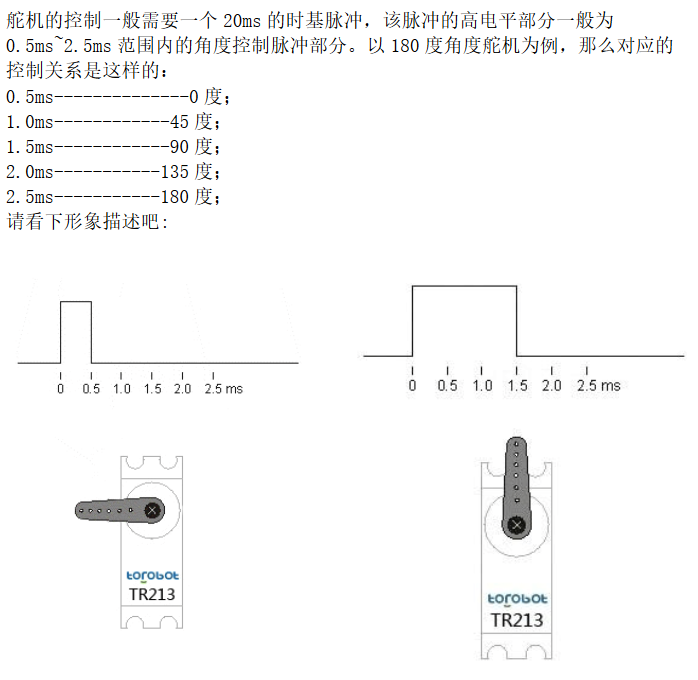

---

### 电机驱动模块
通过控制PWM信号的占空比控制电机的转速；通过控制电机方向引脚控制电机的转动方向

